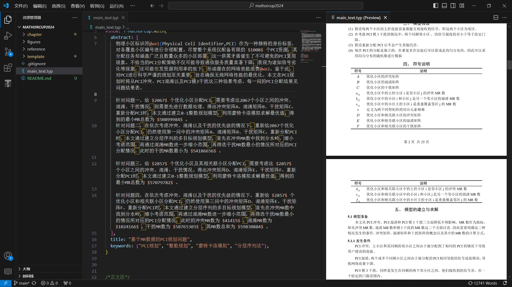
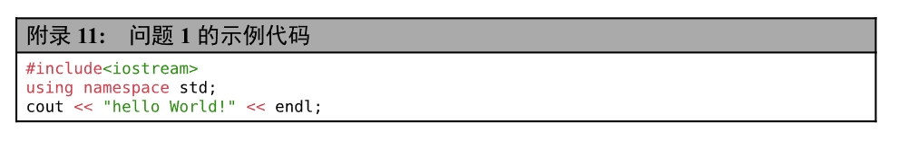

# 一个简易可复用的数模论文模板


本模板，主要包括，定制化了：图片、表格、代码块、附录代码、公式、符号说明等数模中经常使用的模块（详细见 ***[template.typ](./template/template.typ)*** 文件）。

这里不再赘述`typst`的基础语法以及`typst`的安装过程。

---
# 文件结构

- `chapter目录` //用于存放各章节的`.typ`文件
    - `chap1.typ`
    - `chap2.typ`
    - `chap3.typ`
    - `appendix.typ`
    - `...`
- `figures目录`//用于存放各种图片文件
    - `fig1.png`
    - `fig2.jpeg`
    - `icon.svg`
    - `...`
- `reference目录`//存放参考文献
    - `lib.bib`
    - `...`
- `template目录`//存放模板文件
    - `template.typ`//主要模板文件
    - `utils.typ`//存放一些辅助函数
- `.gitignore文件`//git忽略文件
- `main_text.typ文件`//正文主入口文件
- `README.md文件`//介绍文件

该模板采用**多文件存储**，作者认为利用代码来写文字工作的最显著的优势：
- 格式与内容分离(latex思想)
- 能够利用git等工具进行版本控制。（当修改了若干版之后，老板最终决定要第1版的内容时，bushi）
- 能够制作可复用的模板，包括：图、表、公式等。能够做到上下联动进行修改。不用再像word中一处一处的手动修改（虽然也可以利用样式编辑器对部分模块达到联动修改的效果）
- ⭐⭐⭐***最最最主要的我觉得就是能够多文件分离存储***。（曾经，我看到过有同学用word写论文时，大概写了二百多页的时候，每次操作都可以看到word肉眼可见的卡，然后时不时的，Word:未响应。就怕它突然闪退，然后发现自己一下午的劳动成果没了，真的是算是噩梦了。）
---
# 如何使用
## 1. 首先需要在 ***[main_text.typ](./main_text.typ)*** 正文入口文件中头部添加
```typ
#import "template/template.typ":*
#show: template.with(
  abstract: [摘要内容],
  title: "基于MR数据的PCI规划问题",
  keywords: ("key word1", "key word2", "key word3", "..."),
)
```
## 2. 正文书写
> 在导入模板，并应用模板后就可以开始愉快的正文编写了。
这里同样推荐大家分多文件进行正文书写。示例如下：
1. 在`main_text.typ`中书写如下内容
2. 将各章节的`.typ`文件存放于`chapter`目录下
```typ
#import "template/template.typ":*
#import "template/template.typ":template as T-MathorCup

#show: T-MathorCup.with(
  abstract: [摘要内容],
  title: "基于MR数据的PCI规划问题",
  keywords: ("PCI规划", "整数规划", "蒙特卡洛模拟", "分层序列法"),
)

/*正文区*/
//导入各章节
#include "chapter/chap1.typ"
#include "chapter/chap2.typ"
#include "chapter/chap3.typ"
#include "chapter/chap4.typ"
#include "chapter/chap5.typ"
#include "chapter/chap6.typ"

//参考文献
= 参考文献
#bibliography("reference/lib.bib",title:none,)

//附录
#include "chapter/appendix.typ"

```
## 3. 正文中常用模块
+ ## 图片
1. 在正文，如果需要插入图片，首先将图片资源存放在`figures`目录下。
2. 利用 ***[template.typ](./template/template.typ)*** 中所提供的`img()`函数。
3. 使用示例如下
```typ
#img(
  image("../figures/fig1.png", width:85%), 
  caption: "问题一的数据处理示意图"
  )<fig1>
```
首先传入*typst*中的`image()`对象，再指定图注`caption`参数，最后利用`<fig-name>`引用该图片。

+ ## 表格
1. 利用 ***[template.typ](./template/template.typ)*** 中所提供的`tbl()`函数。
2. 使用示例如下：
```typ
#tbl(
  table(
    columns:3,
    align: center+horizon,
    stroke:none,
    table.hline(stroke:1.5pt),
    table.header()[*标题行1*][*标题行2*][*标题行3*],
    table.hline(stroke:1.0pt),
    [测试数据11],[测试数据12],[测试数据13],
    [测试数据21],[测试数据22],[测试数据23],
    table.cell(colspan:3)[...],
    table.hline(stroke:1.5)
  ),
  caption: [测试数据]
)<tab1>
```
> 这里并没有直接将`table()`美化成三线表，主要是考虑更大程度上的自定义。利用原生`table()`能够按照自己的想法进行美化表格以适用于不同的场景。

+ ## 公式
1. 利用 ***[template.typ](./template/template.typ)*** 中所提供的`equation()`函数。
2. 示例如下：
```typ
#equation(
  $ 1-(N / M)^(lambda)>= theta $
)<eq1>
```
> 与图、表一样，公式后同样也可以紧跟引用`<eq1>`用于在正文其他地方进行引用。

+ ## 代码块
1. 利用 ***[template.typ](./template/template.typ)*** 中所提供的`code()`函数。
2. 示例如下：
```
#code(
```cpp
#include<iostream>
using namespace std;
cout << "hello World!" << endl;
```,
caption: [C++代码],
desc: [打印Hello World]
)
```

> - 其中第一个参数：代码内容
> - caption参数：代码的题注
> - desc参数：代码的介绍
> 渲染结果如下：


+ ## 附录代码
1. 利用 ***[template.typ](./template/template.typ)*** 中所提供的`codeAppendix()`函数。
2. 示例如下：
```typ
#let code = ```cpp
#include<iostream>
using namespace std;
cout << "hello World!" << endl;```
#codeAppendix(
    code,
    caption:[问题1的示例代码]
)
```
> 渲染结果如下:


---
# 定制化修改
针对上述模板，如果有任何觉得不太好的地方，想自定义的进行修改。都可以直接对 [template.typ](./template/template.typ)***(建议还是备份一版)*** 中的内容进行修改以达到自己想要的效果。

模板中的绝大多数地方都已加了备注说明，通过查阅[typst官方文档](https://typst.app/docs/) 进行修改即可。

# 后记
最后，介绍一些学习typst的资源
- typst中文翻译文档: https://typst-doc-cn.github.io/docs/
- 小蓝书: https://typst-doc-cn.github.io/tutorial/
- Awesome Typst 中文版: https://github.com/qjcg/awesome-typst/blob/main/README_ZH.md
- 一个typst交流qq群：793548390（里面有很多***大佬***，而且大家也都很热情。活跃度高！）
> 致谢：
>> 最后再次感谢上述qq群中解答过问题的各位大佬。没有你们的答疑解惑，该模板也难以顺利诞生。
